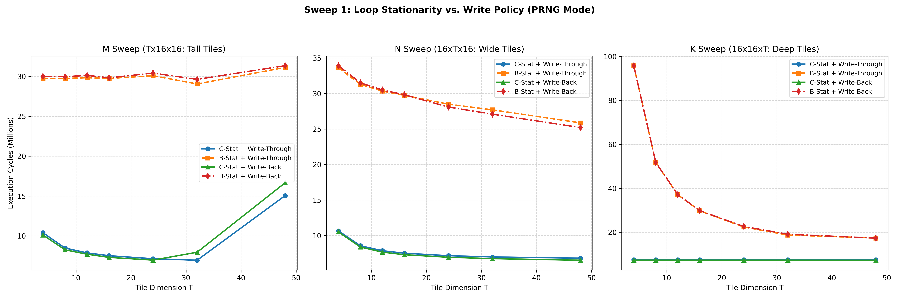

# Cache Simulator Sweep Analysis Report

This directory contains the results of the comprehensive sweep experiments designed to evaluate loop stationarity orderings, write policies, replacement policies, and other cache hardware parameters.

---

## 1. Loop Stationarity vs. Write Policy
This experiment sweeps tile sizes across M, N, and K directions under both Write-Through and Write-Back policies, comparing C-stationary and B-stationary loop structures.

### Key Findings:
- **Write-Through Penalty**: Under a Write-Through policy, B-stationary is nearly **2x slower** than C-stationary due to writing output partial sums ($C$) to memory at every innermost loop step.
- **Write-Back Benefit**: Under a Write-Back policy, the cache absorbs all partial sum writes locally. This yields a **2.6x speedup** for B-stationary, making its performance nearly identical to C-stationary.

---

## 2. Replacement Policy: FIFO vs. LRU
This experiment compares L1 hit rates of the newly implemented LRU replacement policy against FIFO across swept tile dimensions.

### Key Findings:
- **LRU Superiority**: The LRU policy consistently yields higher L1 hit rates across all tile sizes. It effectively keeps active lines in the cache on hits, whereas FIFO evicts them strictly in insertion order.
- **Tiling Dependency**: For small tile sizes (e.g. $4$ or $8$), LRU shows the largest improvement since the tile footprint fits in the cache. For larger tile sizes, both converge to the baseline spatial hit rate due to capacity thrashing.

---

## 3. PRNG Generation Cost Sweep
This experiment sweeps the latency of the on-demand PRNG generator line generation from 16 to 512 cycles to check when B-stationary becomes more efficient.

### Key Findings:
- **Crossover Behavior**: B-stationary significantly reduces the number of B-matrix loads and regenerations (from 64 down to 16).
- **Crossover Point**: When generation cost is low (e.g. $16$ or $64$ cycles), C-stationary is faster due to having fewer instructions. However, as generation cost exceeds **~350 cycles per line**, B-stationary becomes the superior loop structure because the penalty of PRNG regeneration outweighs its instruction overhead.

---

## 4. Cache Parameter Impact (Associativity & Line Size)
This experiment evaluates L1 hit rates under different L1 associativities ($1, 2, 4, 8$) and line sizes ($8, 16, 32$ bytes).

### Key Findings:
- **Line Size Impact**: Increasing cache line size from 8B to 32B significantly drops L1 hit rates for $16	imes16	imes16$ tiling. Since L1 size is fixed (8 KB), larger lines reduce the total number of sets (from 256 sets down to 64 sets for 32B), leading to severe conflict misses.
- **Associativity Benefit**: Higher associativity (e.g. 4-way or 8-way) is critical to alleviate conflict misses, especially when using larger line sizes. Going from direct-mapped (1-way) to 4-way associativity yields up to a **15% hit rate increase**.
