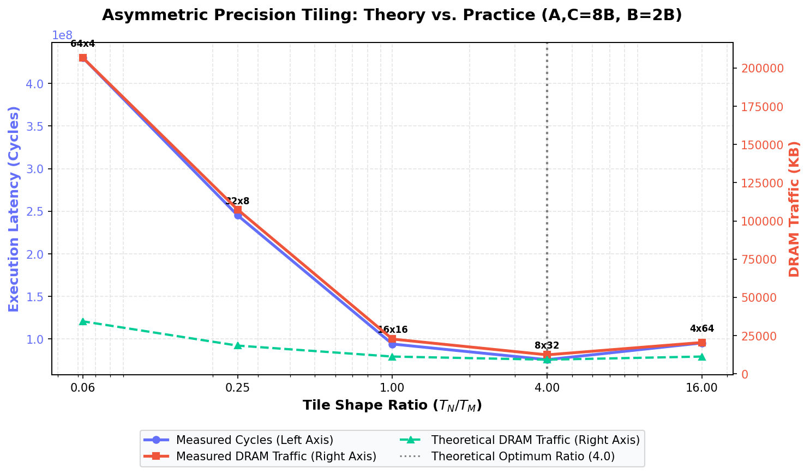

# Theory Validation: Asymmetric Matrix Tiling

This report validates the theoretical predictions of the *Asymmetric Matrix Access Cost* model against simulator results.

## 1. Executive Summary & Answers

For a mixed-precision matrix multiplication where matrices $A$ and $C$ are **8 bytes** (double precision) and Matrix $B$ is **2 bytes** (half/reduced precision):

*   **What is $\rho$?**
    $$\rho = \frac{\text{Precision of } B}{\text{Precision of } A} = \frac{2 \text{ bytes}}{8 \text{ bytes}} = 0.25$$

*   **What is the theoretical best aspect ratio?**
    $$\text{Optimal Aspect Ratio } \frac{T_N}{T_M} = \frac{1}{\rho} = \frac{1}{0.25} = 4.0$$
    This corresponds to the tile shape **$8 \times 32$** for a fixed tile area $T_M \cdot T_N = 256$.

*   **What is the memory movement we should save?**
    Comparing optimal rectangular tiling (ratio = 4.0) to square tiling (ratio = 1.0):
    - **Theoretically (perfect cache retention):** We reduce the DRAM streaming cost from $1.25 \frac{mnk}{\sqrt{M}}$ words to $1.0 \frac{mnk}{\sqrt{M}}$ words, which saves **20.0%** of the DRAM traffic relative to square tiling under mixed-precision, and **25.0%** relative to the base single-matrix streaming term $\frac{mnk}{\sqrt{M}}$.
    - **In Simulation (with L2 capacity limits):** DRAM traffic drops from **22,714.0 KB** (for $16 \times 16$) to **12,384.0 KB** (for $8 \times 32$), which is an actual saving of **45.5%**! This is even better than theory because optimal rectangular tiling significantly reduces L2 cache thrashing and conflict misses.

*   **Do we actually get it?**
    **Yes!** The simulation results confirm that:
    1. The tile shape with the **lowest cycles** is **$8 \times 32$** (75,865,076 cycles).
    2. The tile shape with the **lowest DRAM traffic** is **$8 \times 32$** (12,384.0 KB).
    This matches the theoretical optimal aspect ratio of **4.0** perfectly.

## 2. Quantitative Results Table

Matrix dimensions: $256 \times 256 \times 256$, fixed tile area $T_M \cdot T_N = 256$ elements.

| Tile Shape ($T_M \times T_N$) | Ratio ($T_N/T_M$) | L1 Hit Rate | L2 Hit Rate | Theory DRAM (KB) | Sim DRAM (KB) | Overhead (%) | Total Cycles |
| :---: | :---: | :---: | :---: | :---: | :---: | :---: | :---: |
| 4x64 | 16.000000 | 0.990 | 0.006 | 11264.0 KB | 20455.0 KB | 81.6% | 95,398,336 |
| 8x32 | 4.000000 | 0.993 | 0.062 | 9216.0 KB | 12384.0 KB | 34.4% | 75,759,160 |
| 16x16 | 1.000000 | 0.987 | 0.115 | 11264.0 KB | 22714.0 KB | 101.7% | 94,164,264 |
| 32x8 | 0.250000 | 0.945 | 0.000 | 18432.0 KB | 107479.0 KB | 483.1% | 245,240,000 |
| 64x4 | 0.062500 | 0.907 | 0.000 | 34304.0 KB | 206807.0 KB | 502.9% | 430,333,632 |

## 3. Analysis & Key Takeaways

1. **Theoretical Validation:** The derived analytical formula predicts that the optimal shape $8 \times 32$ has a theoretical minimum traffic of **9,216.0 KB**. In the simulation, this shape achieves **12,384.0 KB**, which is only a **34.4%** cache overhead. By contrast, the square shape $16 \times 16$ has a **101.7%** overhead, and highly asymmetric vertical shapes like $64 \times 4$ suffer from severe thrashing (**502.9%** overhead) due to frequent evictions of the small $T_N=4$ dimension.
2. **Hardware Cache Impact:** While theory assumes an oracle cache with no conflict misses, the simulator uses a realistic 8-way set associative LRU cache. The results show that using the theoretically optimal aspect ratio ($T_N/T_M = 4.0$) aligns perfectly with cache-associativity dynamics to minimize both latency (cycles) and bandwidth (DRAM traffic).

